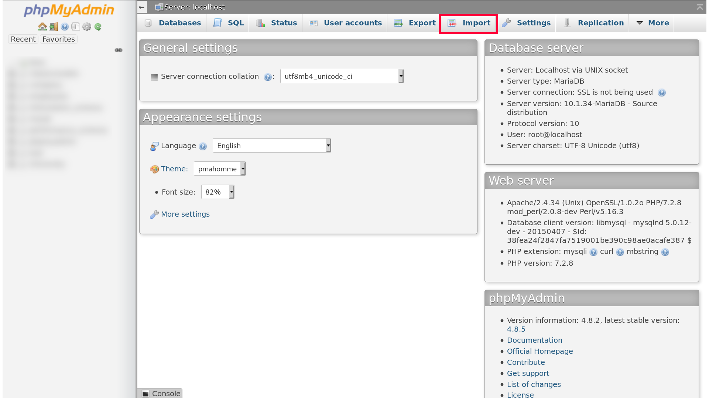
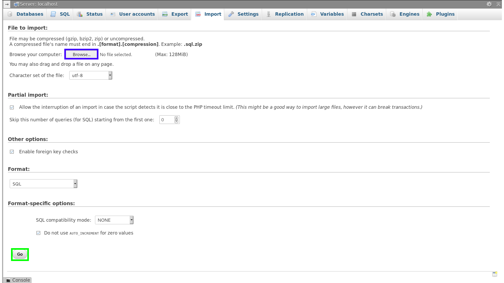
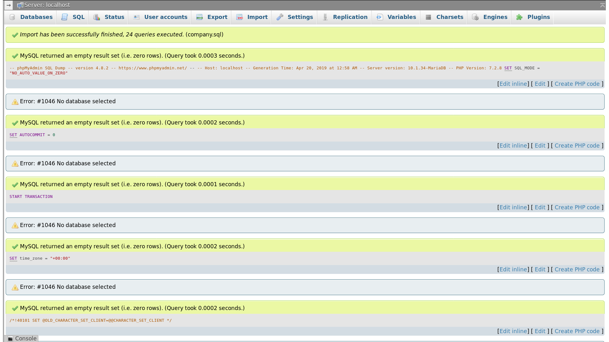
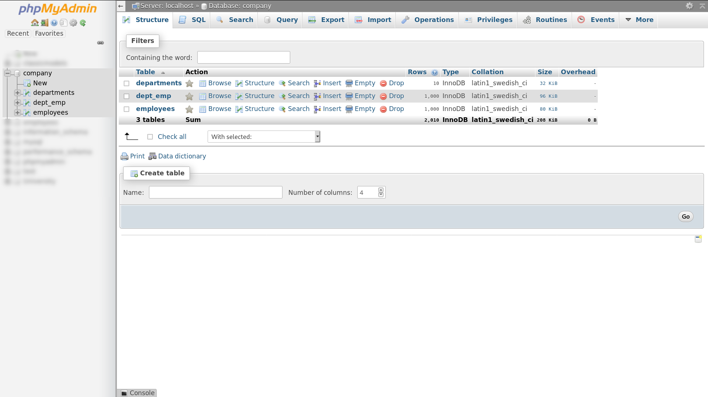
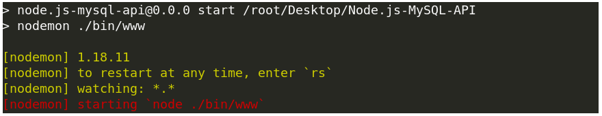
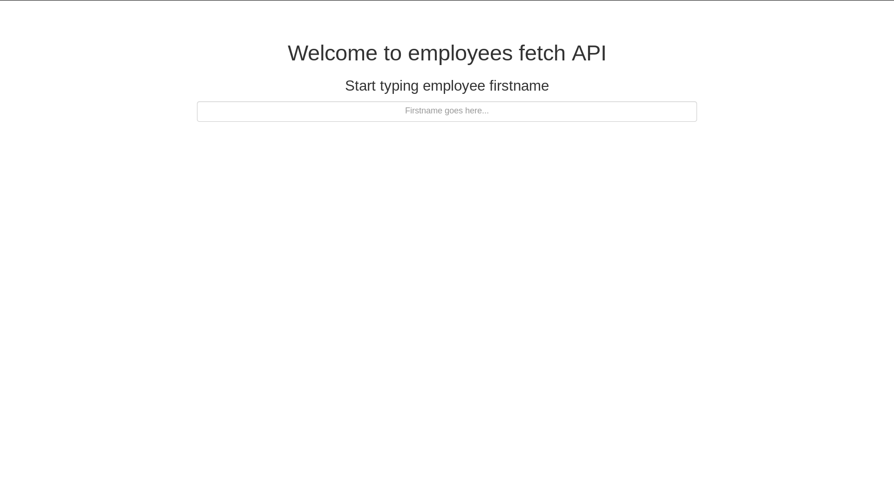

# API-Example
A repository that contains a small example to demonstrate what is an API

# Introduction
One of my friends asked me to explain what is an API, so i searched around and found that the best way to do this is to build a small application where user request info about employees through URL GET parameters.

# Dependencies
- axios >= 0.18.0
- body-parser >= 1.18.3
- cookie-parser >= 1.4.3
- debug >= 2.6.9
- express >= 4.16.0
- http-errors >= 1.6.2
- morgan >= 1.9.0
- mysql >= 2.17.1
- nodemon >= 1.18.11
- pug >= 2.0.3

# Installation:
Clone the repository using:
```
git clone https://github.com/Eyad-Mohammed-Osama/API-Example.git
```
Then `cd` to `API-Example`.

Next step is to run `npm install` in order to install all the dependencies.

Now you need to import the database into your MySQL server, the file `company.sql` is a minified version of the employees database created by <a href="https://launchpad.net/test-db" target="_blank">LaunchPad</a> [Warning: Link open in new tab].

You can just copy the code inside `company.sql` to the SQL tab inside your phpMyAdmin client, or you can import the whole file at once:
  - Click the <b>import</b> button:
  
  
  
  - Now click the <b>Browse...</b> button, choose `company.sql` file (from the project folder), then click the `Go` button:
  
  
  
  - If all goes well, message like this should appear:
  
  
  
  - And a `company` database is created:
  
  
  
We're still not ready yet, some configurations are required.

# Configuration
## Database connection credentials
In project folder, there's a folder called `models`, inside it there's a file called `db.js`.

This file basically contains an instance of MySQL connection.

From there you can change login credentials (if it's necessary), and the provided values are the default values for super user (root).

## More configurations
Further configurations can be done inside `bin/www` and `app.js`.

(<b>Warning</b> unless you know what you're doing, don't screw `www` file neither `app.js` file, otherwise your application might not be able to start, you've been warned).

# Running this whole thing
Inside project folder, just run `npm start` from your terminal, something like this should appear:



Now open <a href="http://localhost:8000/">http://localhost:8000/</a>, the following screen will show:



And that's it, everything has been confirmed to be working.

# Usage
  - The link <a href="http://localhost:8000/employees">http://localhost:8000/employees</a> returns a JSON response that contains the info of all employees in `employees` table.
  - The link <a href="http://localhost:8000/employees/firstname/SOMETHING">http://localhost:8000/employees/firstname/SOMETHING</a> returns a JSON response that contains the info of all employees whose firstnames starts with `SOMETHING`.
  - The link <a href="http://localhost:8000/employees/limit/NUMBER">http://localhost:8000/employees/limit/NUMBER</a> returns a JSON response that contains the info of the first `NUMBER` employees.
  - The link <a href="http://localhost:8000/employees/firstname/SOMETHING/limit/NUMBER">http://localhost:8000/employees/firstname/SOMETHING/limit/NUMBER</a> returns a JSON response that contains the info of the first `NUMBER` employees whose firstnames starts with `SOMETHING`.
